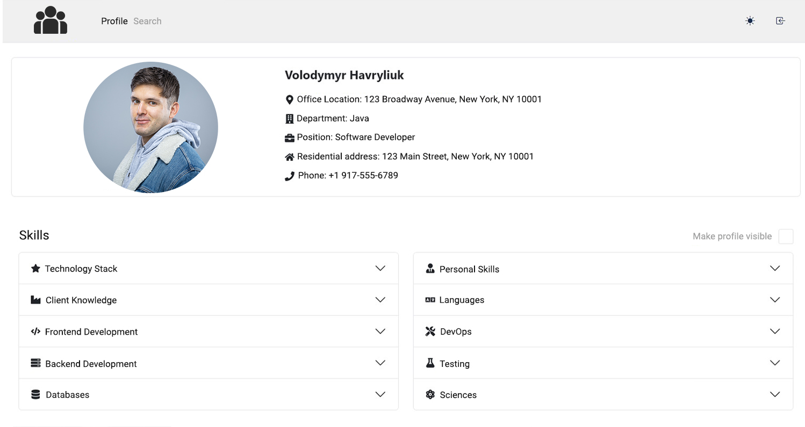
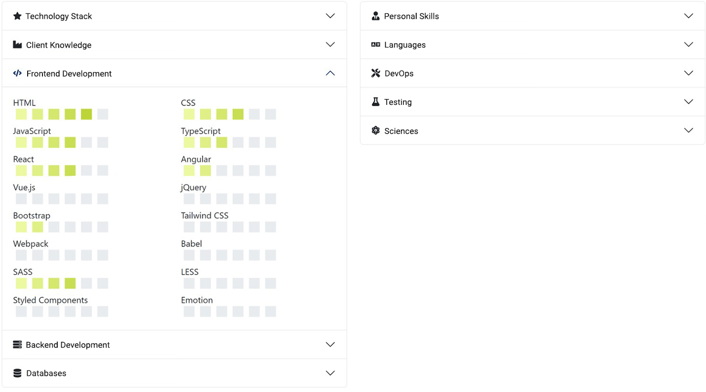
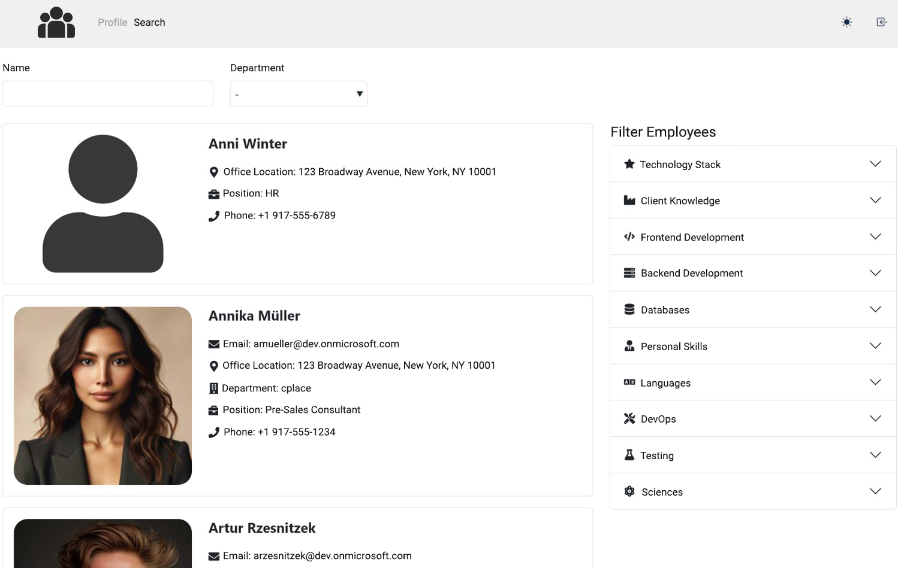

# 🚀 TalendMatch

**A modern web application to optimize project planning by visualizing and managing employee skills.**  
Easily find the right talent for your project needs through smart search and intuitive filtering.

---

This is how the employee profile looks after authentication.

You can fill in your own skills, make your profile visible not only to team leads but also to other employees. There is also an option in the menu to switch to dark mode and log out of the account.

This is what the employee search page looks like. You can search by name, department, or skills.

And this is what the page looks like when we have selected a few skills for a search.

## ✨ Features

- 🔐 Secure Microsoft Entra ID (SSO, OAuth2) authentication
- 🧠 Central skill management – employees can manage and update their skill levels
- 🔍 Powerful search and filter functionality for project leads
- 🧩 Custom visibility settings for user profiles
- 🌙 Dark and Light mode toggle
- 💡 Clean, responsive interface using React Bootstrap

---
## 🛠️ Tech Stack

**Frontend:**
- React (TypeScript)
- Redux Toolkit & RTK Query
- React Bootstrap

**Backend:**
- Java 17
- Spring Boot
- PostgreSQL
- Microsoft Graph API
- Microsoft Entra ID

---

## 🧩 Architecture

The app is structured using the **MVC (Model-View-Controller)** pattern:

- **Model:** Entities (Employee, Skill, Level, EmployeeSkill)
- **View:** React components 
- **Controller:** Spring REST controllers

---

## 🔮 Future Enhancements

- 📝 Let users propose new skills via the UI
- 🧑‍💼 Admin dashboard for approving custom skills
- 📈 Analytics: Skill distribution, usage heatmaps
- 🔁 Export/import employee skill profiles (CSV/JSON)

---

## 👤 Author

**Volodymyr Havryliuk**  
GitHub: [@wladyDE](https://github.com/wladyDE)  
